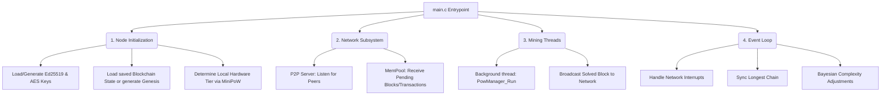

# Main Node Daemon (`main.c`) Roadmap

This document serves as a blueprint and mindmap for implementing the actual blockchain node runtime (`src/main.c`). Up until now, the project has focused on building the consensus primitives (MiniPoW and TierPoW). The `main.c` file will act as the living event loop (the "daemon") that binds these primitives to the real world (Network, Storage, and Concurrency).

---

## 🗺️ Architectural Mindmap

---

## 🛤️ Implementation Roadmap

### Phase 1: Bootstrapping & Storage
- **Goals:** Securely spin up the node and restore state.
- **Tasks:**
  1. Parse command-line args (e.g., `--network testnet`, `--port 8080`).
  2. Implement `load_sign_keys` and `load_enc_keys` (from `LinuxUtils.h`) to mount the wallet.
  3. Attempt to `load_chain_state()`. If no state exists on disk, construct the node's very first `Gensis_Block`.
  4. Perform a local `MiniPow_Run_Classifier()` to assign the node its hardware tier (MCU, EDGE, DESKTOP, or SERVER).

### Phase 2: The Core Event Loop (Single-Threaded Scaffold)
- **Goals:** Keep the node alive and listening.
- **Tasks:**
  1. Set up an infinite loop: `while(node_is_running) { ... }`.
  2. Integrate a basic UNIX signal handler (e.g., `SIGINT`/`CTRL+C`) to cleanly save the chain state (`save_chain_state`) to disk before exiting.

### Phase 3: P2P Networking (The Mempool)
- **Goals:** Communicate with other PKCertChain nodes.
- **Tasks:**
  1. Open a non-blocking TCP/UDP socket on the designated port.
  2. Implement packet parsers for canonical serialization structures (Network byte order / Big-Endian).
  3. Create an incoming queue (`tierPoWQueue`) to accept new blocks from peers. If a peer broadcasts a block, verify it securely using `verify_tier_pow_solution()`.
  4. If a received block is fully valid and its height is greater than your local `chain->index`, append it!

### Phase 4: Active Mining (Concurrency)
- **Goals:** Participate in consensus while simultaneously listening to peers.
- **Tasks:**
  1. Spawn a `pthread` specifically dedicated to mining.
  2. In the mining thread, continuously feed the latest network state into `PKCertChain_AddBlockWithPoW()`.
  3. If the mining thread solves a block, push it to the main thread's Mempool.
  4. The main thread then broadcasts this newly serialized block over the TCP socket to all connected peers.

---

## 🛑 What to Avoid in `main.c`
- **Do not put crypto logic here:** Keep all hashing and cryptography inside `include/util/`.
- **Do not put block validation here:** Validation belongs inside `PowManager` and `block.h`. `main.c` should strictly be "glue code" that passes buffers to the headers.
- **Do not hardcode IP addresses:** Use a peer-discovery file or DNS seeds.
